# 🤖 Da_Bot - Enhanced Smart AI Assistant with MediaPipe Integration

> A comprehensive AI-powered assistant featuring advanced computer vision, natural language processing, real-time analysis, speech recognition, and sentiment analysis capabilities.

[](https://www.python.org/downloads/)
[](https://streamlit.io/)
[](LICENSE)
[](https://github.com/fasih245/AI-Assistant/graphs/commit-activity)

## 🌟 Overview

Da_Bot is a cutting-edge, multi-modal AI assistant that combines artificial intelligence with advanced computer vision, speech processing, and real-time analysis capabilities. Built with Streamlit and powered by multiple AI models, it offers a comprehensive suite of tools for object detection, pose analysis, emotion recognition, sentiment analysis, speech interaction, and intelligent conversation with enhanced email integration.

## 🏗️ System Architecture & Flow

The following flowchart illustrates Da_Bot's comprehensive architecture, from startup initialization through all major features and processing flows:

```mermaid
flowchart TD
    A[🚀 Da_Bot Startup] --> B{🔧 System Initialization}
    B --> C[📦 Load Dependencies]
    B --> D[🎛️ Initialize Session State]
    B --> E[🎨 Apply Theme Configuration]
    
    C --> C1[🤖 AI Models<br/>Gemini Pro & Groq LLaMA]
    C --> C2[👁️ Computer Vision<br/>YOLO v8 & MediaPipe]
    C --> C3[🎤 Audio Systems<br/>TTS & Speech Recognition]
    C --> C4[😊 Emotion Detection<br/>TensorFlow Model]
    C --> C5[💭 Sentiment Analysis<br/>VADER & TextBlob]
    
    D --> D1[💬 Chat History: 20 msgs]
    D --> D2[📄 Documents: 200MB limit]
    D --> D3[🎭 Detection History: 50 items]
    D --> D4[⚙️ User Preferences]
    
    E --> E1[🌙 Dark Theme<br/>Professional Gradients]
    E --> E2[☀️ Light Theme<br/>Clean Interface]
    
    C1 --> F[📱 Main Navigation]
    C2 --> F
    C3 --> F
    C4 --> F
    C5 --> F
    
    F --> G1[💬 Enhanced Chat Assistant]
    F --> G2[🎭 Object Segmentation]
    F --> G3[🤖 MediaPipe Analysis]
    F --> G4[🤸 Pose Detection]
    F --> G5[😊 Emotion Analysis]
    F --> G6[📹 Real-time Camera]
    F --> G7[💭 Sentiment Dashboard]
    F --> G8[📊 Analytics & History]
    
    %% Enhanced Chat Assistant Flow
    G1 --> H1[📝 Text Input]
    G1 --> H2[🎤 Voice Input]
    G1 --> H3[📁 Document Upload]
    
    H1 --> I1{🧠 AI Processing}
    H2 --> I2[🔄 Speech-to-Text] --> I1
    H3 --> I3[📖 RAG Processing] --> I1
    
    I1 --> J1[🎭 Mood Selection<br/>13 Conversation Styles]
    I1 --> J2[🌡️ Temperature Control<br/>0.0-2.0 Creativity]
    I1 --> J3[📏 Token Limit<br/>100-1000 words]
    
    J1 --> K[🤖 AI Response Generation]
    J2 --> K
    J3 --> K
    
    K --> L1[💬 Text Response]
    K --> L2[🔊 Audio Response]
    K --> L3[📧 Email Integration]
    
    %% Computer Vision Flow
    G2 --> M1[📷 Image Upload]
    G3 --> M1
    G4 --> M1
    G5 --> M1
    G6 --> M2[📹 Live Camera Feed]
    
    M1 --> N{🔍 Analysis Selection}
    M2 --> N
    
    N --> N1[🎭 YOLO Segmentation<br/>3 Output Modes]
    N --> N2[👤 MediaPipe Face<br/>468 Landmarks]
    N --> N3[✋ MediaPipe Hands<br/>21 Points Each]
    N --> N4[🤸 MediaPipe Pose<br/>33 Body Points]
    N --> N5[😊 Emotion Recognition<br/>7 Categories]
    
    N1 --> O1[🖼️ SG: Segmented Image]
    N1 --> O2[📦 BB: Bounding Boxes]
    N1 --> O3[🎨 Pure Masks]
    
    N2 --> P1[👤 Face Bounding Boxes]
    N3 --> P2[✋ Hand Skeleton]
    N4 --> P3[🤸 Pose Skeleton]
    N5 --> P4[😊 Emotion Labels]
    
    %% Real-time Processing
    G6 --> Q1[🔄 Auto-Capture System<br/>1-10s Intervals]
    Q1 --> Q2{⏱️ Timeout Protection}
    Q2 --> Q3[🖥️ Windows Threading]
    Q2 --> Q4[🐧 Unix Signal Handling]
    
    Q3 --> R[📊 Live Results Dashboard]
    Q4 --> R
    
    %% Analytics and Dashboard
    G7 --> S1[📈 Real-time Sentiment]
    G8 --> S2[📊 Detection Analytics]
    
    S1 --> T1[📝 Text Analysis<br/>VADER + TextBlob]
    S1 --> T2[📊 Batch Processing]
    S1 --> T3[📈 Trend Visualization]
    
    S2 --> U1[🎭 Object Frequency]
    S2 --> U2[🎯 Confidence Distribution]
    S2 --> U3[📅 Historical Trends]
    
    %% Data Flow and Storage
    R --> V[💾 Data Storage]
    T1 --> V
    T2 --> V
    U1 --> V
    
    V --> V1[📄 Documents Cache<br/>200MB Support]
    V --> V2[🎭 Detection History<br/>50 Items Max]
    V --> V3[💭 Sentiment History<br/>50 Analyses]
    V --> V4[📊 Performance Metrics]
    
    %% Export and Integration
    V --> W[📤 Export Options]
    W --> W1[📧 Email Reports<br/>Unicode Safe]
    W --> W2[📊 CSV Analytics]
    W --> W3[📋 JSON Settings]
    W --> W4[📄 PDF Reports]
    
    %% Error Handling and Recovery
    K --> X{❌ Error Detection}
    R --> X
    V --> X
    
    X --> X1[🔄 Automatic Retry<br/>3 Attempts]
    X --> X2[⬇️ Graceful Fallback<br/>Alternative Methods]
    X --> X3[📝 Error Logging<br/>User Friendly Messages]
    
    X1 --> Y[🔧 Recovery Actions]
    X2 --> Y
    X3 --> Y
    
    Y --> Y1[🧹 Cache Cleanup]
    Y --> Y2[🔄 Model Reload]
    Y --> Y3[📱 UI Reset]
    
    %% Performance Optimization
    Y --> Z[⚡ Performance Monitor]
    Z --> Z1[💾 Memory Usage<br/>Real-time Tracking]
    Z --> Z2[🖥️ CPU Utilization]
    Z --> Z3[📊 Session Metrics]
    Z --> Z4[🧹 Auto Cache Clear]
    
    %% Security and Configuration
    Z --> AA[🔐 Security Layer]
    AA --> AA1[🔑 API Key Management<br/>.env Protection]
    AA --> AA2[📧 Email Encryption<br/>SMTP TLS]
    AA --> AA3[📄 File Validation<br/>Size & Type Limits]
    AA --> AA4[🛡️ Input Sanitization]
    
    %% Final Output and User Experience
    AA --> BB[🎯 User Experience]
    BB --> BB1[🎨 Professional UI<br/>Dark/Light Themes]
    BB --> BB2[📱 Responsive Design<br/>Mobile Optimized]
    BB --> BB3[⚡ Real-time Feedback<br/>Progress Indicators]
    BB --> BB4[🔊 Accessibility<br/>Screen Reader Support]
    
    BB --> CC[✅ Mission Complete<br/>Enterprise-Ready AI Assistant]
    
    %% Styling
    classDef aiModel fill:#ff6b6b,stroke:#333,stroke-width:2px,color:#fff
    classDef vision fill:#4ecdc4,stroke:#333,stroke-width:2px,color:#fff
    classDef audio fill:#45b7d1,stroke:#333,stroke-width:2px,color:#fff
    classDef analytics fill:#f9ca24,stroke:#333,stroke-width:2px,color:#333
    classDef storage fill:#6c5ce7,stroke:#333,stroke-width:2px,color:#fff
    classDef security fill:#fd79a8,stroke:#333,stroke-width:2px,color:#fff
    classDef success fill:#00b894,stroke:#333,stroke-width:2px,color:#fff
    
    class C1,I1,K aiModel
    class C2,N1,N2,N3,N4,N5 vision
    class C3,H2,I2,L2 audio
    class S1,S2,T1,T2,U1,U2 analytics
    class V,V1,V2,V3,V4 storage
    class AA,AA1,AA2,AA3,AA4 security
    class CC success
```



### 🔍 Architecture Highlights

The flowchart above showcases Da_Bot's sophisticated architecture with the following key components:

**🚀 Initialization Phase**
- **System Boot**: Comprehensive startup sequence with dependency loading
- **Multi-Model Loading**: AI models (Gemini, Groq), Computer Vision (YOLO, MediaPipe), Audio systems
- **Session Management**: Chat history, document cache, user preferences
- **Theme Configuration**: Dynamic dark/light theme system

**🧠 Core Processing Flows**
- **Enhanced Chat Assistant**: Multi-modal input (text, voice, documents) with 13 conversation moods
- **Computer Vision Pipeline**: Object segmentation, pose detection, emotion analysis, MediaPipe integration
- **Real-time Analysis**: Live camera feed with auto-capture and timeout protection
- **Analytics Dashboard**: Comprehensive tracking and visualization of all system activities

**🔄 Advanced Features**
- **Cross-Platform Compatibility**: Windows threading and Unix signal handling
- **Error Recovery**: Automatic retry mechanisms and graceful fallbacks
- **Performance Optimization**: Memory management, CPU monitoring, auto cache clearing
- **Security Layer**: API key protection, email encryption, input sanitization

## ✨ Key Features

### 🧠 Advanced AI Conversation Engine
- **Multi-Model Support**: Integration with Google Gemini and Groq APIs with intelligent fallbacks
- **13 Dynamic Conversation Moods**: Professional, Casual, Sarcastic, Inspirational, Mentoring, and more
- **Enhanced RAG (Retrieval-Augmented Generation)**: Upload documents up to **200MB** for context-aware responses
- **Advanced Temperature Control**: Fine-tune creativity and randomness (0.0-2.0)
- **Smart Document Processing**: Enhanced PDF and TXT support with 200-page processing capability
- **Intelligent Response Length Control**: Configurable token limits (100-1000)

### 🎤 Speech & Audio Integration
- **Multi-Platform Speech Recognition**: Cross-platform voice input with timeout protection
- **Advanced Text-to-Speech (TTS)**: Multiple TTS methods with intelligent fallbacks
  - Google Text-to-Speech (gTTS) with enhanced audio quality
  - System TTS (Windows SAPI, macOS Say, Linux eSpeak/Festival)
  - Pyttsx3 for offline speech synthesis
  - Web-based browser TTS as ultimate fallback
- **Voice-Powered Chat**: Speak your questions and hear AI responses
- **Smart Audio Processing**: Emoji removal, text cleaning, and enhanced pronunciation
- **Real-time Speech Status**: Live monitoring of speaking and listening states

### 👁️ Enhanced Computer Vision Suite
- **YOLO Object Detection v8**: Real-time object segmentation with three specialized output modes
  - **Object Segmented (SG)**: Masks overlaid on original image with transparency control
  - **Object Detected (BB)**: Professional bounding boxes with confidence labels
  - **Pure Segmentation Masks**: Clean, exportable mask overlays
- **Advanced MediaPipe Integration**: Cross-platform timeout protection and error handling
  - **Face Detection**: High-precision facial recognition with confidence scoring
  - **Hand Landmarks**: 21-point hand tracking with gesture analysis
  - **Pose Landmarks**: 33-point full-body pose estimation
  - **Face Mesh**: 468 facial landmark detection (optional)
- **Enhanced Emotion Recognition**: 7-category emotion analysis with realistic simulation
- **Pose Estimation**: Human pose detection with 17 COCO keypoint analysis and skeleton visualization

### 📹 Real-Time Analysis & Auto-Capture
- **Live Camera Feed**: Real-time video processing with professional UI
- **Intelligent Auto-Capture System**: Configurable intervals (1-10 seconds) with timeout protection
- **Multi-Modal Analysis**: Simultaneous object, pose, emotion, and MediaPipe detection
- **Performance Monitoring**: Advanced memory usage tracking and cache management
- **Windows-Compatible Threading**: Cross-platform timeout handling for stable operation
- **Live Feed Dashboard**: Real-time analytics with detection history

### 📊 Advanced Analytics & Dashboards
- **Object Detection Dashboard**: Comprehensive tracking with frequency analysis and confidence metrics
- **Live Sentiment Analysis**: Real-time text sentiment with VADER, TextBlob, and keyword analysis
  - **Batch Processing**: Analyze multiple texts simultaneously
  - **Trend Visualization**: Historical sentiment tracking with charts
  - **Export Capabilities**: CSV and JSON export for analysis results
- **Detection Analytics**: Object frequency, confidence distribution, and temporal trends
- **Performance Metrics**: System resource monitoring and optimization recommendations

### 📧 Enhanced Email Integration
- **Unicode-Safe Email System**: Advanced emoji and special character handling
- **Multi-Format Email Support**: HTML and plain text with professional styling
- **Email Preview System**: See cleaned content before sending
- **Connection Testing**: Verify Gmail credentials and SMTP connectivity
- **Smart Text Cleaning**: Automatic emoji-to-text conversion with 25+ mappings
- **Email Validation**: Real-time email format verification

### 🎨 Professional User Experience
- **Dynamic Dark/Light Themes**: Customizable UI with professional gradient styling
- **Responsive Design**: Optimized for desktop, tablet, and mobile viewing
- **Interactive Controls**: Real-time sliders, progress indicators, and live feedback
- **Enhanced Navigation**: Intuitive page system with quick actions
- **Performance Dashboard**: Live system monitoring with cache management
- **Professional Animations**: Smooth transitions and visual feedback

## 🚀 Quick Start

### Prerequisites

- Python 3.9 or higher
- Webcam (for real-time analysis features)
- Microphone (for speech input features)
- API Keys (optional, for enhanced AI features):
  - Google Gemini API key
  - Groq API key
  - Gmail credentials for email features

### Installation

1. **Clone the repository:**
   ```bash
   git clone https://github.com/fasih245/AI-Assistant
   cd AI-Assistant
   ```

2. **Create a virtual environment:**
   ```bash
   python -m venv env
   source env/bin/activate  # On Windows: env\Scripts\activate
   ```

3. **Install core dependencies:**
   ```bash
   pip install -r requirements.txt
   ```

4. **Install optional audio packages (recommended):**
   ```bash
   # For advanced speech features
   pip install gtts pygame pyttsx3 SpeechRecognition pyaudio
   
   # For enhanced sentiment analysis
   pip install vaderSentiment textblob
   python -m textblob.download_corpora
   ```

5. **Set up environment variables:**
   ```bash
   # Create .env file
   touch .env  # On Windows: type nul > .env
   ```
   
   Add your API keys to `.env`:
   ```env
   # AI Model APIs
   GOOGLE_API_KEY=your_gemini_api_key_here
   GROQ_API_KEY=your_groq_api_key_here
   
   # Email Configuration
   GMAIL_EMAIL=your_email@gmail.com
   GMAIL_APP_PASSWORD=your_gmail_app_password_here
   
   # Model Configuration (optional)
   YOLO_SEGMENTATION_MODEL=yolov8m-seg.pt
   YOLO_POSE_MODEL=yolov8m-pose.pt
   EMOTION_MODEL_PATH=./models/emotion_model.h5
   MAX_FILE_SIZE_MB=200
   ```

6. **Initialize models:**
   ```bash
   # The app will automatically create compatible models on first run
   python -c "import streamlit as st; print('Setup complete!')"
   ```

7. **Run the application:**
   ```bash
   streamlit run Da_Bot.py
   ```

8. **Open your browser** and navigate to `http://localhost:8501`

## 📖 Comprehensive Usage Guide

### Getting Started
1. **Configure Settings**: Use the enhanced sidebar to adjust AI temperature, mood, and confidence thresholds
2. **Test Audio Features**: Use the Audio Package Manager to install and test speech features
3. **Choose Your Experience**: Navigate between 8 different feature pages
4. **Upload Content**: Add documents (up to 200MB) for RAG or images for computer vision analysis
5. **Start Analyzing**: Use real-time camera, speech input, or upload content for instant analysis

### Feature Deep Dive

#### 💬 Enhanced Chat Assistant
- **Document Upload**: Support for PDF/TXT files up to 200MB with 200-page processing
- **Dynamic Temperature Control**: Adjust creativity from focused (0.0) to highly creative (2.0)
- **13 Conversation Moods**: Professional, Casual, Sarcastic, Mentoring, Consoling, and more
- **Speech Integration**: Voice input with "🎤 Speak" and audio output with "🔊 Read"
- **Enhanced Email**: Send responses with automatic emoji cleaning and HTML formatting
- **Smart Context Search**: Advanced RAG with relevance scoring and context highlighting

#### 🎭 Enhanced Object Segmentation
- **Three Output Modes**: SG (Segmented), BB (Bounding Boxes), Pure Masks
- **Real-time Dashboard**: Object frequency tracking, confidence distribution, and trend analysis
- **Opacity Control**: Adjustable mask transparency (0.1-0.9)
- **Export Analytics**: Download detection results and dashboard data
- **Professional Visualization**: Color-coded confidence levels and detailed breakdowns

#### 🤖 MediaPipe Multi-Modal Analysis
- **Cross-Platform Support**: Windows, macOS, and Linux compatibility with timeout protection
- **Face Detection**: High-precision detection with bounding boxes and confidence scoring
- **Hand Landmarks**: 21-point hand tracking with handedness detection
- **Pose Landmarks**: 33-point full-body pose estimation with visibility tracking
- **Error Recovery**: Intelligent fallback systems for model loading failures

#### 🤸 Advanced Pose Detection
- **Dual Method Support**: Choose between YOLO v8 and MediaPipe pose detection
- **17 Keypoint Analysis**: Full COCO pose format with skeleton visualization
- **Confidence Filtering**: Adjustable thresholds for pose detection accuracy
- **Detailed Analytics**: Keypoint confidence, position tracking, and person identification

#### 😊 Enhanced Emotion Analysis
- **7 Emotion Categories**: Angry, Disgust, Fear, Happy, Sad, Surprise, Neutral
- **Realistic Simulation**: Face feature analysis for improved emotion detection
- **Confidence Visualization**: Probability breakdown with bar charts
- **Face Detection**: Automatic face region identification and processing
- **Model Compatibility**: Auto-creation of compatible TensorFlow models

#### 📹 Professional Real-Time Camera
- **Live Video Feed**: High-quality real-time processing with professional UI
- **Auto-Capture System**: Configurable intervals (1-10 seconds) with timeout protection
- **Multi-Modal Analysis**: Simultaneous object, pose, emotion, and MediaPipe processing
- **Results Dashboard**: Live analytics with detection history and trends
- **Performance Optimization**: Memory management and threading for smooth operation

#### 💭 Live Sentiment Analysis Dashboard
- **Real-Time Analysis**: Instant sentiment scoring as you type
- **Multiple Analyzers**: VADER (advanced), TextBlob (basic), Keyword (fallback)
- **Comprehensive Dashboard**: Statistics, trends, and historical analysis
- **Batch Processing**: Analyze multiple texts simultaneously with progress tracking
- **Export Functionality**: Download results as CSV or JSON
- **Advanced Analytics**: Confidence distribution, sentiment trends, and insights

#### 📊 Chat History & Analytics
- **Conversation Tracking**: Detailed history with mood and settings metadata
- **Usage Analytics**: Mood distribution, RAG usage, and conversation patterns
- **Export Options**: Download chat history and analysis results
- **Resume Conversations**: Continue previous chats with context preservation

## 🛠️ Advanced Configuration

### Environment Variables

| Variable | Description | Default | Required |
|----------|-------------|---------|----------|
| `GOOGLE_API_KEY` | Google Gemini API key for enhanced AI responses | - | Optional |
| `GROQ_API_KEY` | Groq API key for fast AI responses | - | Optional |
| `GMAIL_EMAIL` | Gmail address for email features | - | Optional |
| `GMAIL_APP_PASSWORD` | Gmail app password for SMTP | - | Optional |
| `YOLO_SEGMENTATION_MODEL` | YOLO model for object segmentation | `yolov8m-seg.pt` | Auto |
| `YOLO_POSE_MODEL` | YOLO model for pose detection | `yolov8m-pose.pt` | Auto |
| `EMOTION_MODEL_PATH` | Path to emotion detection model | `./models/emotion_model.h5` | Auto |
| `MAX_FILE_SIZE_MB` | Maximum upload file size | `200` | Auto |
| `CAMERA_WIDTH` | Camera resolution width | `640` | Auto |
| `CAMERA_HEIGHT` | Camera resolution height | `480` | Auto |

### Audio Configuration

| Package | Features | Installation |
|---------|----------|-------------|
| `gtts` + `pygame` | High-quality Google TTS | `pip install gtts pygame` |
| `pyttsx3` | Offline TTS with voice selection | `pip install pyttsx3` |
| `SpeechRecognition` | Cross-platform speech input | `pip install SpeechRecognition` |
| `pyaudio` | Audio I/O support | `pip install pyaudio` |

### Model Configuration

| Setting | Options | Description |
|---------|---------|-------------|
| Segmentation Opacity | 0.1 - 0.9 | Transparency of object masks |
| Pose Confidence | 0.1 - 0.9 | Minimum confidence for pose detection |
| Emotion Confidence | 0.1 - 0.9 | Minimum confidence for emotion detection |
| Auto-Capture Interval | 1-10 seconds | Time between automatic captures |
| Max Detection History | 10-100 items | Number of detections to store |

## 📁 Enhanced Project Structure

```
Da_Bot/
├── Da_Bot.py                     # Main application file (enhanced)
├── requirements.txt              # Python dependencies
├── README.md                     # This comprehensive guide
├── .gitignore                    # Git ignore rules
├── .env                          # Environment variables (create this)
├── .streamlit/
│   └── config.toml              # Streamlit configuration
├── models/                       # AI model storage (auto-created)
│   ├── emotion_model.h5         # Emotion detection model
│   ├── emotion_model.keras      # Alternative format
│   ├── yolov8m-seg.pt          # YOLO segmentation (auto-downloaded)
│   └── yolov8m-pose.pt         # YOLO pose detection (auto-downloaded)
├── documents/                    # Document upload storage
├── temp/                         # Temporary files and audio
├── logs/                         # Application logs
└── audio_cache/                  # TTS audio cache (auto-created)
```

## 🔧 Enhanced API Setup Guide

### Google Gemini API
1. Visit [Google AI Studio](https://makersuite.google.com/app/apikey)
2. Create a new API key for Gemini Pro
3. Add to your `.env` file as `GOOGLE_API_KEY`
4. Test connection using the sidebar system status

### Groq API (Fast LLaMA)
1. Visit [Groq Console](https://console.groq.com/keys)
2. Create a new API key
3. Add to your `.env` file as `GROQ_API_KEY`
4. Enjoy lightning-fast AI responses

### Gmail Integration (Enhanced)
1. Enable 2-factor authentication on your Gmail account
2. Generate an app password (not your regular password)
3. Add your email and app password to `.env`
4. Test connection using the email test feature

### Speech Recognition Setup
1. **Windows**: Usually works out of the box
2. **macOS**: `brew install portaudio` then `pip install pyaudio`
3. **Linux**: `sudo apt-get install portaudio19-dev python3-pyaudio`

## 🎯 Performance Optimization Guide

### System Requirements

| Component | Minimum | Recommended | Optimal |
|-----------|---------|-------------|---------|
| **RAM** | 4GB | 8GB | 16GB+ |
| **CPU** | 2-core | 4-core | 8-core+ |
| **Storage** | 2GB free | 5GB free | 10GB+ free |
| **GPU** | Integrated | GTX 1060 | RTX 3070+ |
| **Network** | 10 Mbps | 50 Mbps | 100 Mbps+ |

### Optimization Strategies

#### For Lower-End Systems:
```bash
# Install CPU-only PyTorch for better compatibility
pip uninstall torch torchvision -y
pip install torch torchvision --index-url https://download.pytorch.org/whl/cpu

# Reduce auto-capture frequency
# Set intervals to 5-10 seconds in real-time camera

# Use basic sentiment analysis
# Disable VADER and TextBlob if not needed
```

#### For High-End Systems:
```bash
# Install GPU-accelerated PyTorch
pip uninstall torch torchvision -y
pip install torch torchvision --index-url https://download.pytorch.org/whl/cu118

# Enable all features
# Use 1-2 second auto-capture intervals
# Enable all MediaPipe models
```

#### Memory Management:
- Use the "🧹 Clear Cache" button regularly
- Monitor memory usage in the Performance Monitor
- Close unused browser tabs and applications
- Restart the app every few hours during intensive use

## 🐛 Comprehensive Troubleshooting

### Installation Issues

**PyTorch/YOLO Import Errors:**
```bash
# Complete reinstall for PyTorch
pip uninstall torch torchvision ultralytics -y
pip install torch torchvision --index-url https://download.pytorch.org/whl/cpu
pip install ultralytics

# If CUDA errors persist
pip uninstall torch torchvision -y
pip install torch==2.0.1 torchvision==0.15.2 --index-url https://download.pytorch.org/whl/cpu
```

**Audio Package Issues:**
```bash
# Windows
pip install pyaudio
# If that fails:
pip install pipwin
pipwin install pyaudio

# macOS
brew install portaudio
pip install pyaudio

# Linux (Ubuntu/Debian)
sudo apt-get install portaudio19-dev python3-pyaudio
pip install pyaudio
```

**MediaPipe Import Errors:**
```bash
pip uninstall mediapipe -y
pip install mediapipe==0.10.0
```

### Runtime Issues

**Camera Access Problems:**
1. Check camera permissions in system settings
2. Close other applications using the camera (Zoom, Skype, etc.)
3. Try different camera indices (0, 1, 2) in the sidebar settings
4. Restart the application and try again

**Model Loading Errors:**
```bash
# Clear model cache
rm -rf models/  # On Windows: rmdir /s models\
# Restart the app - models will be recreated
```

**Memory/Performance Issues:**
1. Use the "🧹 Clear Cache" button in Performance Monitor
2. Reduce image upload sizes (under 10MB for better performance)
3. Lower auto-capture frequency in real-time mode
4. Close memory-intensive applications
5. Restart the Streamlit app every few hours

**Email Sending Failures:**
1. Verify Gmail app password (not regular password)
2. Check 2-factor authentication is enabled
3. Test connection using the email test feature
4. Try with a different recipient email address

**Speech Recognition Issues:**
1. Check microphone permissions
2. Test microphone with other applications
3. Adjust timeout settings in the sidebar
4. Try different speech recognition engines

### Error Codes and Solutions

| Error | Cause | Solution |
|-------|-------|----------|
| `StreamlitDuplicateElementId` | Button key conflicts | Fixed in current version |
| `ASCII codec can't encode` | Email emoji issues | Fixed with enhanced email system |
| `Camera not found` | Camera access issues | Check permissions and camera index |
| `Model loading timeout` | Network/system slow | Increase timeout or restart |
| `Audio device not found` | Microphone issues | Check audio device settings |

## 🤝 Contributing

We welcome contributions! Da_Bot is designed to be extensible and community-driven.

### Development Setup
1. Fork the repository
2. Create a feature branch: `git checkout -b feature/amazing-feature`
3. Install development dependencies: `pip install -r requirements-dev.txt`
4. Make your changes with proper testing
5. Commit your changes: `git commit -m 'Add amazing feature'`
6. Push to the branch: `git push origin feature/amazing-feature`
7. Open a Pull Request with detailed description

### Contribution Guidelines
- Follow PEP 8 coding standards
- Add docstrings to all functions
- Include error handling and user feedback
- Test on multiple platforms when possible
- Update documentation for new features

### Priority Areas for Contribution
- [ ] Additional language support for speech
- [ ] Custom model training interfaces
- [ ] Advanced export formats (PDF reports)
- [ ] Mobile app development
- [ ] Cloud deployment templates
- [ ] Performance optimizations

## 📄 License

This project is licensed under the MIT License - see the [LICENSE](LICENSE) file for details.

## 🙏 Acknowledgments

### Core Technologies
- **Streamlit**: For the incredible web app framework
- **Google MediaPipe**: For advanced computer vision capabilities
- **Ultralytics YOLO**: For state-of-the-art object detection
- **OpenCV**: For computer vision fundamentals
- **TensorFlow**: For deep learning capabilities
- **Google Gemini & Groq**: For powerful AI language models

### Special Recognition
- **VADER Sentiment**: For advanced sentiment analysis
- **pyttsx3 & gTTS**: For cross-platform text-to-speech
- **SpeechRecognition**: For reliable speech input
- **Pillow & NumPy**: For image processing excellence

## 📞 Support & Community

### Getting Help
1. **Documentation**: Check this comprehensive README first
2. **Issues**: Browse [existing issues](https://github.com/fasih245/AI-Assistant/issues)
3. **New Issue**: Create detailed bug reports or feature requests
4. **Discussions**: Join community discussions for questions

### Bug Reports
Please include:
- Operating system and Python version
- Complete error messages and stack traces
- Steps to reproduce the issue
- Screenshots if applicable
- System specifications (RAM, CPU, GPU)

### Feature Requests
We love new ideas! Please describe:
- The problem you're trying to solve
- Your proposed solution
- Any alternative solutions considered
- Additional context or mockups

## 🔮 Roadmap & Future Features

### Version 3.0 (Coming Soon)
- [ ] **Multi-Language Support**: UI translation and international speech models
- [ ] **Custom Model Training**: Train your own emotion and object detection models
- [ ] **Advanced Voice Interaction**: Continuous conversation mode with wake words
- [ ] **Collaborative Features**: Share sessions and results with team members
- [ ] **API Endpoints**: RESTful API for integration with other applications

### Version 3.5 (Planning)
- [ ] **Mobile Application**: Native iOS and Android apps
- [ ] **Cloud Sync**: Synchronize settings and history across devices
- [ ] **Advanced Analytics**: Machine learning insights and pattern recognition
- [ ] **Plugin System**: Extensible architecture for community plugins
- [ ] **Real-time Collaboration**: Multi-user sessions with live sharing

### Long-term Vision
- [ ] **AR/VR Integration**: Augmented reality overlays and virtual reality support
- [ ] **Edge Computing**: Optimized models for edge devices and IoT
- [ ] **Advanced AI Models**: Integration with latest GPT, Claude, and custom models
- [ ] **Enterprise Features**: User management, audit logs, and compliance tools

## 📊 Version History

### v2.0.0 (Current) - "Enhanced Intelligence"
- ✅ Advanced speech recognition and text-to-speech
- ✅ Enhanced email system with Unicode support
- ✅ Live sentiment analysis dashboard
- ✅ Cross-platform MediaPipe integration
- ✅ Professional UI with dark/light themes
- ✅ Object detection dashboard and analytics
- ✅ Auto-capture camera system
- ✅ Enhanced document processing (200MB support)

### v1.5.0 - "MediaPipe Integration"
- ✅ MediaPipe face, hand, and pose detection
- ✅ Enhanced emotion recognition
- ✅ Real-time camera analysis
- ✅ Improved YOLO object detection

### v1.0.0 - "Foundation"
- ✅ Basic chat functionality
- ✅ YOLO object segmentation
- ✅ Pose detection
- ✅ Emotion analysis
- ✅ Document RAG support

---

<div align="center">

## 🌟 Star This Project!

**If Da_Bot helped you or impressed you, please give us a star ⭐**

**Your support helps us continue improving and adding new features!**

---

### 🔗 Quick Links

[🐛 Report Bug](https://github.com/fasih245/AI-Assistant/issues/new?template=bug_report.md) • 
[✨ Request Feature](https://github.com/fasih245/AI-Assistant/issues/new?template=feature_request.md) • 
[📖 Documentation](https://github.com/fasih245/AI-Assistant/wiki) • 
[💬 Discussions](https://github.com/fasih245/AI-Assistant/discussions)

---

**Created with ❤️ by [Fasih Ul Haq](https://github.com/fasih245)**

*"Making AI accessible, powerful, and fun for everyone"*

</div>